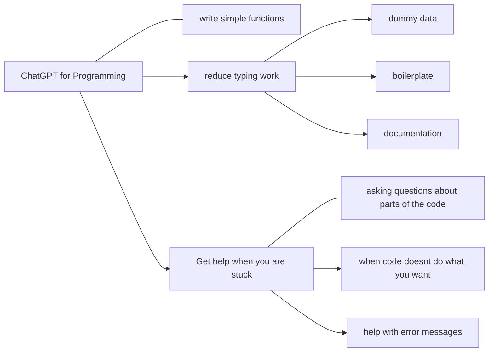

# ChatGPT for Programming

## Links
- <a href="https://chat.openai.com/chat" target="_blank">Chat GPT</a>
<br />
- <a href="https://platform.openai.com/playground" target="_blank">OpenAI Playground</a>
<br />
- <a href="https://platform.openai.com/examples/default-fix-python-bugs" target="_blank">OpenAI Bugfix Example</a>
<br />
- <a href="https://platform.openai.com/examples/default-python-docstring" target="_blank">OpenAI Documentation Example</a>
<br />
- <a href="https://replit.com/@KatharinaNi/chatgpt-test#main.py" target="_blank">Repl for testing code</a>
<br /><br /><br /><br />




<br /><br /><br /><br /><br /><br />

### write simple functions

> write a python function that takes in a csv file with the columns: name, date of birth (YYYY-MM-DD), location. it filters out everyone who is older than 60 years and returns a list with all names. some names have Chinese characters.
> 

Result:

```python
import pandas as pd
from datetime import datetime

def filter_by_age(csv_file):
    df = pd.read_csv(csv_file, encoding='utf-8')
    today = datetime.now().date()
    df['date_of_birth'] = pd.to_datetime(df['date_of_birth'])
    df['age'] = (today - df['date_of_birth'].dt.date).dt.days / 365
    names = df[df['age'] < 60]['name'].tolist()
    return names
```
<a href="https://htmlpreview.github.io/?https://github.com/k4th4/chatgpt_for_programming/blob/main/Filter_CSV_By_Age_Names.html" target="_blank">Filter CSV By Age Names.html</a>

<br /><br /><br /><br /><br /><br />

## Reduce typing work

### dummy data example

> output the text of a csv file with three columns: 'name', 'date_of_birth', 'location'. create 12 lines of dummy data, half of the lines should be older than 60 (on 12th of Feb 2023), and half of the names should be Chinese, and one third of the locations should be in mainland China, one third in Taiwan
> 

```python
name,date_of_birth,location
John Doe,1960-01-01,New York
Jane Doe,1955-07-07,Los Angeles
王伟,1965-03-03,北京
李梅,1950-04-04,上海
张三,1980-05-05,台北
李四,1985-06-06,台中
Michael Johnson,1950-07-07,London
Sarah Smith,1958-08-08,Paris
李康,1960-09-09,北京
王金,1953-10-10,台北
陆涛,1980-11-11,上海
陈伟,1985-12-12,香港
```

<a href="https://htmlpreview.github.io/?https://github.com/k4th4/chatgpt_for_programming/blob/main/CSV_File_Data_Output.html" target="_blank">CSV File Data Output.html</a>


<br /><br /><br /><br /><br /><br />


### boilerplate example (flask)

> create a flask app which in which you can enter a Chinese sentence. it then outputs the audio text to speech and displays the pinyin.
> 

```python
from flask import Flask, request, render_template
import gTTS
import pinyin

app = Flask(__name__)

@app.route('/', methods=['GET', 'POST'])
def index():
    if request.method == 'POST':
        text = request.form['text']
        pinyin_text = pinyin.get(text, format="strip", delimiter=" ")
        tts = gTTS(text=text, lang='zh-cn')
        tts.save("text_to_speech.mp3")
        return render_template('index.html', text=text, pinyin=pinyin_text)
    return render_template('index.html')

if __name__ == '__main__':
    app.run()
```

```html
<html>
  <head>
    <title>Chinese TTS and Pinyin</title>
  </head>
  <body>
    <form method="post">
      <textarea name="text"></textarea>
      <button type="submit">Submit</button>
    </form>
    
      <p>Text: {{ text }}</p>
      <p>Pinyin: {{ pinyin }}</p>
      <audio controls>
        <source src="text_to_speech.mp3" type="audio/mpeg">
        Your browser does not support the audio element.
      </audio>
    
  </body>
</html>
```

<a href="https://htmlpreview.github.io/?https://github.com/k4th4/chatgpt_for_programming/blob/main/Flask_TTS_Pinyin_App.html" target="_blank">Flask TTS Pinyin App.html</a>
<a href="https://replit.com/@KatharinaNi/flask-tts" target="_blank">Replit Example</a>


<br /><br /><br /><br /><br /><br />

### write documentation

> i want to create documentation for the following function with ‘mkdocstrings’. add type hints, and create a docstring which contains 5 examples, args and returns:
```python
def filter_by_age(csv_file):
 df = pd.read_csv(csv_file, encoding='utf-8')
 today = datetime.now().date()
 df['date_of_birth'] = pd.to_datetime(df['date_of_birth'])
 df['age'] = (today - df['date_of_birth'].dt.date).dt.days / 365
 names = df[df['age'] < 60]['name'].tolist()
 return names
```
Result:

```python
def filter_by_age(csv_file: str) -> List[str]:
    """
    Filters the names of individuals whose age is less than 60 years, from a CSV file.

    Args:
    - csv_file (str): The path of the CSV file containing information about individuals.
                      The file should have at least two columns named 'name' and 'date_of_birth'.

    Returns:
    - List[str]: A list of names of individuals whose age is less than 60 years.

    Example:
    1. filter_by_age("people.csv") -> ['John Doe', 'Jane Doe']
    2. filter_by_age("employees.csv") -> ['Bob Smith', 'Alice Johnson']
    3. filter_by_age("students.csv") -> ['Michael Jordan', 'Kobe Bryant']
    4. filter_by_age("teachers.csv") -> ['Jim Brown', 'Jerry Rice']
    5. filter_by_age("colleagues.csv") -> ['Tom Cruise', 'Brad Pitt']

    Note:
    - The function assumes that the 'date_of_birth' column in the CSV file is in a valid datetime format.
    """
    df = pd.read_csv(csv_file, encoding='utf-8')
    today = datetime.now().date()
    df['date_of_birth'] = pd.to_datetime(df['date_of_birth'])
    df['age'] = (today - df['date_of_birth'].dt.date).dt.days / 365
    names = df[df['age'] < 60]['name'].tolist()
    return names
```

<a href="https://htmlpreview.github.io/?https://github.com/k4th4/chatgpt_for_programming/blob/main/Python_Code_Documentation_Elements.html" target="_blank">Python Code Documentation Elements.html</a>


<br /><br /><br /><br /><br /><br />

## Get help when you are stuck

### asking questions about specific parts of the code

what does this line on code: 
```python
pinyin_text = pinyin.get(text, format="strip", delimiter=" ")
```
does in this function?
```python
def index():
    if request.method == 'POST':
        text = request.form['text']
        pinyin_text = pinyin.get(text, format="strip", delimiter=" ")
        tts = gTTS(text=text, lang='zh-cn')
        tts.save("text_to_speech.mp3")
        return render_template('index.html', text=text, pinyin=pinyin_text)
    return render_template('index.html')
```
Result:

>This line of code uses the pinyin library to convert the Chinese characters in the text variable into their corresponding pinyin pronunciations. The format="strip" argument tells the library to strip out any spaces between the pinyin syllables, and the delimiter=" " argument tells it to separate the syllables with a space. The resulting pinyin pronunciation is stored in the pinyin_text variable, which is then passed to the render_template function along with the original text variable, to be displayed on the webpage.


<a href="https://htmlpreview.github.io/?https://github.com/k4th4/chatgpt_for_programming/blob/main/Convert%20Chinese%20to%20Pinyin.html" target="_blank">Function Explainer.html</a>

<br /><br /><br /><br /><br /><br />

### when code doesn’t do what you want

```python
import datetime as dt
def date_func(date_list):
 if len(date_list)>2:
  date = dt.datetime(date_list[0][0], date_list[0][1], date_list[0][2])
 else:
 date = dt.datetime.today()
 return date
date_list_1 = [(2022,1,2),(2022,1,3),(2022,1,4)]
-> None
```

> why does this function return none?
import datetime as dt
def date_func(date_list):
 if len(date_list)>2:
  date = dt.datetime(date_list[0][0], date_list[0][1], date_list[0][2])
 else:
 date = dt.datetime.today()
 return date
date_list_1 = [(2022,1,2),(2022,1,3),(2022,1,4)]
> 


<a href="https://htmlpreview.github.io/?https://github.com/k4th4/chatgpt_for_programming/blob/main/Function_Returns_None.html" target="_blank">Function Returns None.html</a>

<br /><br /><br /><br /><br /><br />

### help with error messages

```python
import datetime as dt
date = dt.datetime(2022,10,2)
def one_day_later():
 date += date + datetime.timedelta(days=1)
 return date

print(one_day_later())
```

> I got a error message for this function:
import datetime as dt
date = dt.datetime(2022,10,2)
def one_day_later():
 date += date + datetime.timedelta(days=1)
 return date
print(one_day_later())
the error message is:
Traceback (most recent call last):
File "[main.py](http://main.py/)", line 7, in <module>
print(one_day_later())
File "[main.py](http://main.py/)", line 4, in one_day_later
date += date + datetime.timedelta(days=1)
UnboundLocalError: local variable 'date' referenced before assignment
Please help me
> 

```python
import datetime as dt
date = dt.datetime(2022,10,2)
def one_day_later():
  global date
  date += dt.timedelta(days=1)
  return date

print(one_day_later())
```

```python
import datetime as dt
def one_day_later(date):
  return date + dt.timedelta(days=1)

date = dt.datetime(2022,10,2)
date = one_day_later(date)
print(date)
```


 <a href="https://htmlpreview.github.io/?https://github.com/k4th4/chatgpt_for_programming/blob/main/Fix_Datetime_Error_Message_(1).html" target="_blank">Fix Datetime Error Message.html</a>
